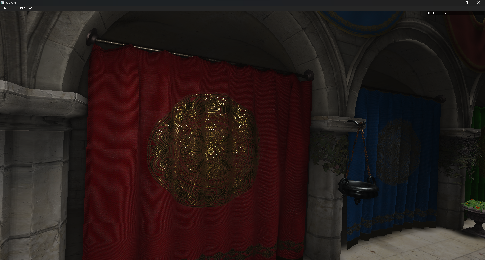

# M3D_lite

## Présentation

Ceci est une version ameliorée d'un projet réalisé durant ma première année du master ISICG. Le projet consistait à créer de toute pièce un moteur de rendu temps réel basé sur opengl. Avec ce moteur, il est possible de changer dynamiquement les objets qui composent la scène en ajoutant des assets ou en chargeant des scènes complètes.

Le moteur supporte deux formats de description de scène : le gltf et glb. Ces formats de fichier permettent de décrire des scènes assez complexes et dans le moteur vous pouvez retrouver :
- Trois types de lumière : la point light, la spot light, la sun light.
- Deux types de caméra : perspective, orthographique.
- Un graphe de scène qui décrit une hiérachie de transformations qui sont appliquées aux objets de la scène. L'utilisation d'un graphe de scène permet au moteur de supporter l'instancing. 
- Des matériaux physicaly based qui sont attachés aux objets.

En ce qui concerne le rendu de la scène, il est réalisé par deffered shading, l'ombre produite par les lumières est calculée par des shadows map et par la suite plusieurs opérations de post-processing sont réalisées pour rendre l'image finale (bloom, tone mapping et gama correction).

## Résulats

| Pub | Pub zoom |
| - | - |
|  |  |

| Sponza | Sponza zoom |
| - | - |
|  |  |

| Emissive | Musee  |
| - | - |
|  |  |

## Améliorations

Les plus urgentes :
- Implémentation du papier [Screen Space Indirect Lighting with Visibility Bitmask](https://arxiv.org/pdf/2301.11376.pdf) pour approximer l'illumination gobale de la scène.
- Implémentation d'une méthode "order independency transparency" par le biais de [per pixel linked list](https://ubm-twvideo01.s3.amazonaws.com/o1/vault/gdc10/slides/Thibieroz_Nicolas_AdvancedVisualEffectsWithDirect3D_OIT_and_Indirect_Illumination_using_DX11_Linked_Lists_part1.pdf) pour la gestion des objets transparents.
- Implémentation de méthodes d'anti-alliasing (FXAA - SMAA).

Accélération des calculs :
- Ajout de "frustum culling" grâce à l'utilisation de boîtes englobantes et d'une hiérachie de scène. 
- Utilisation de "frustum culling" pour la génération des cartes d'ombrage.
- Ajout d'occlusion culling.

Améliorer les ombres :
- Calcul de l'ombre projetée des objets transparents par l'utilisation de techniques de "weighted blending".
- Utilisation de [cascade shadow map](https://developer.download.nvidia.com/SDK/10.5/opengl/src/cascaded_shadow_maps/doc/cascaded_shadow_maps.pdf) pour réduire l'effet de crénelage des ombres.
- Utilisation d'un biais dynamique basé sur les méthodes de "slope-scale depth biais" dans le but d'entièrement supprimer le shadow acne et le Peter Panning.
- Filtrage de l'ombre par [Percentage_Closer_Soft_Shadows](https://http.download.nvidia.com/developer/presentations/2005/SIGGRAPH/Percentage_Closer_Soft_Shadows.pdf).

Rendre le monde plus vivant :
- Rendu d'athmosphère grâce à la méthode de Sébastien Hillaire, [A Scalable and Production Ready Sky and Atmosphere Rendering Technique](https://sebh.github.io/publications/egsr2020.pdf).
- Gestion du skinnig des meshes.
- Ajout d'un moteur physique.
